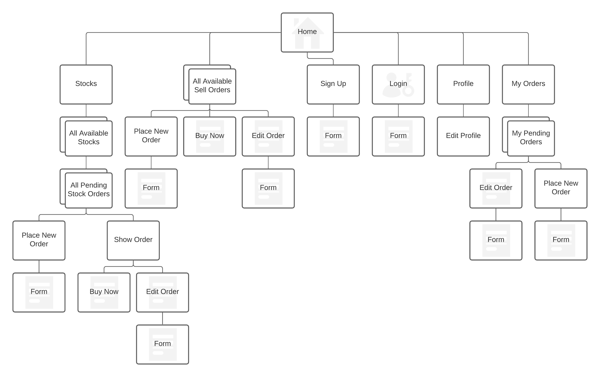
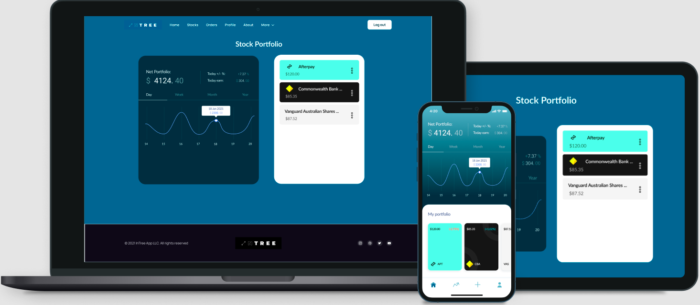
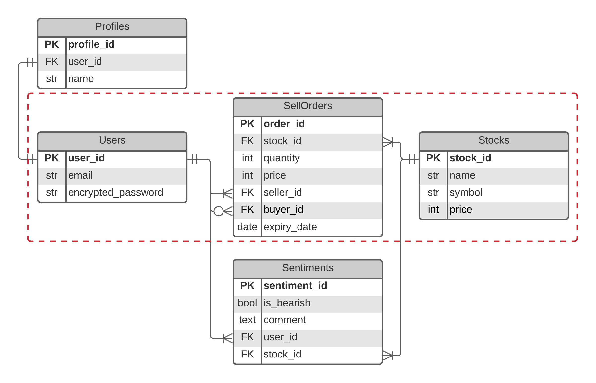

# InTree Marketplace - Web 3.0 for Stocks and Finance

------

InTree Marketplace is a marketplace web application revolutionising the way stocks are being bought and sold on a day-to-day basis. The main aim is to allow customers to expand their ways of entering into the stock market whilst having a great user experience (UX). 

## Table of Contents

------

[TOC]

## Problem Statement

------

### R7. Identification of the problem you are trying to solve by building this particular marketplace app.

Current trading platforms, such as CommSec and Interactive Brokers, have outdated user interfaces and make it extremely difficult for customers to find out relevant information about the stocks they purchase. Also, as opposed to platforms such as Robinhood and Stake, the barrier to entry and understanding investing are extremely difficult as extensive amounts of documentations are required to verify your identity, despite the information already available to the banks.

### R8. Why is it a problem that needs solving?

As current bond yields continue to drop and interest rates are at all-time lows, other avenues to maintaining people's wealth are necessary to avoid the consequences of the devaluing of their savings. These other avenues include property (due to wage growth stagnation, most people are priced out of property investments), commodities (not a viable option to hold store large quantities of commodities, such as gold, at home) and cryptocurrencies (whilst this is possible, many view this to be a very risky asset due to its small track record/history). Hence, whilst it may be somewhat risky, it is the most acceptable and viable option for customers getting into investing.

## Getting started

------

### R9. Heroku Deployment 

>  https://intree-marketplace.herokuapp.com/

InTree Marketplace is currently running continuous deployment via the GitHub `main` branch.

### R10. GitHub repository

> https://github.com/whywesmurfing/InTreeApp-marketplace

### Setting up

#### Installation

First, clone the app into your desired directory by running:

``` bash
git clone https://github.com/whywesmurfing/InTreeApp-marketplace.git
```

You may be required to authorise access to clone the application in your directory.

Once cloned/downloaded, change the directory into the application:

```bash
cd InTreeApp-marketplace
```

Now, install InTree Marketplace by downloading all the app's dependencies:

```bash
bundle install
```

And installing the project dependencies:

```bash
yarn install --check-files
```

Next, run the following commands to generate the database and pre-populate data in the database:

```bash
rails db:create
rails db:migrate
rails db:seed
```

Once the database has been created and populated, you will be required to delete `credentials.yml.enc`, which is found in the `config` folder of the application. 

Here, you will be required to create your own `master.key`:

```bash
EDITOR="code --wait" rails credentials:edit
```

And then put in your own Cloudinary and Stripe API keys (these will be found once your account has been made):

```yaml
cloudinary:
  service: Cloudinary  
  cloud_name: <cloud_name>
  api_key: <cloudinary public key>
  api_secret: <cloudinary secret key>

stripe:
  secret_key: <stripe secret key>
  public_key: <stripe public key>
```

Once completed, you will be able to start the server:

```bash
rails s
```

From here, log into Ultrahook (`https://www.ultrahook.com/`) to receive webhooks on your local machine. Follow steps provided in the email set upon signup.

Once setup, go to `localhost:3000` and you will be able to use the application.

You can create your own log in details or use one of the following test accounts:

| Email           | Password |
| --------------- | -------- |
| test1@email.com | test1a   |
| test2@email.com | test2b   |
| test3@email.com | test3c   |
| test4@email.com | test4d   |

#### Deployment

To deploy the application, you must log in to Heroku:

```bash
heroku login
```

Then create the application in heroku:

```bash
heroku create
```

Once created, generate the database in Heroku:

```bash
heroku run rails db:create
heroku run rails db:migrate
heroku run rails db:seed
```

Once the database is created, the Heroku application has been successfully deployed and ready to be used.

#### Potential issues and fixes/solutions

When creating a new user, should you experience the following errors, please run the corresponding commands:

- `PG::UniqueViolation: ERROR: duplicate key value violates unique constraint "users_pkey" DETAIL: Key (id)=(1) already exists.`

This error occurs when `rails db:seed` runs to pre-populate the data and auto-generates the `user` data. To resolve this, run the following commands:

```bash
rails c
irb(main):> ActiveRecord::Base.connection.tables.each { |t| ActiveRecord::Base.connection.reset_pk_sequence!(t) }
exit
```

If issue occurs when creating user in the Heroku application, run the following commands:

```bash
heroku run rails c
irb(main):> ActiveRecord::Base.connection.tables.each { |t| ActiveRecord::Base.connection.reset_pk_sequence!(t) }
exit
```

## Introduction to InTree Marketplace 

------

### R11. Description

#### Purpose (Have a bit of research in this section)

Customers are bombarded with information on a daily basis and it is making it increasingly difficult for people to make well informed decisions. The purpose of the InTree Marketplace is aiming to revolutionise the way current customers will purchase stocks and other financial instruments whilst providing the on-demand information about the stock at the time of purchase. 

#### Target Audience

- 18-24 year olds who are interested in getting into the market but find poor UX in existing apps and trading platforms
- Users who predominantly conduct their business via mobile are always on-the-go. 

#### Features

The InTree Marketplace application features:

- Secure Authentication

  - Log In / Log Out - allows users to login and logout from the application securely.
  - Sign Up - allows users to create their own account and access the application.

- Authorisation - provides access to certain users based on their roles and IDs. 

- Responsive navbar - changes from a standard navbar to a hamburger menu when reduced to below specific width

- Stripe payment - provides a payment option via Stripe to allow the user purchase the sell order when credit card details are provided

- Upload capabilities - allows users to upload images into Active Storage and hence Cloudinary (as long as it is below 3MB in size)

  > Note: PDF documents are allowed, however there are currently limitations to the free versions of Cloudinary with a lack of PDF management.

#### Sitemap

To navigate through the website, please follow the below sitemap:



#### Technology Stack

- HTML + CSS for Front End (JS for Hamburger Menu and Payment)
- Ruby on Rails for Back End Development (Ruby version 2.7.2)
- PostgreSQL for Relational Database Management System (DBMS)
- Heroku for Deployment and Continuous Integration

##### Dependencies

- Rails ver. 6.0.3.5
- Tailwind CSS ver. 2.0.3
- Webpacker ver. 4.3.0
- PostgreSQL ver. 2.0
- Cloudinary ver. 1.18.1
- Active Storage Validations ver. 0.9.2
- Stripe ver. 5.29.1

## Product Development

### R12. User stories 

Users:

- As a user, I want to be able to sign up to the page.
- As a user, I want to be able to login to my portfolio.
- As a user, I want to see all the available orders on the homepage.
- (in progress) As a user, I want to leave sentiment (bullish or bearish) or a review on how I think the stock is going.
- (in progress) As a user, I want to see the graphs for the stocks and changing the view of the graph between days, weeks, months and years. 

Sellers:

- As a seller, I want to create a sell order of my stock, setting the price and how long it is going to be on the market for.
- As a seller, I want to be able to see all my orders I have on for sale.
- As a seller, I want to be able to change the price and the limit on the date it will stay on the marketplace for.
- As a seller, I want to be able to delete my orders before the expiry date, in case I wanted to keep the stock.

Buyers:

- As a buyer, I want to be able to purchase a stock via a sell order.
- As a buyer, I want to see all the stocks I have in my portfolio.
- (optional) As a buyer, I want to create an order of the stock when it drops to a certain price.

### R13. Wireframes 



The inspiration for the initial designs and wireframes were a combination of applications, including [Uniswap](https://app.uniswap.org/#/swap), an liquidity platform for cryptocurrencies with a simple UX design, and [Stake](https://hellostake.com/au/), a trading platform innovating the way stocks are traded with a minimalist design. Minimalism was a core inspiration in the design of the marketplace as existing platforms are complicated to read and have dated web designs.

Links to Wireframes:

> Desktop: https://www.figma.com/file/4sPWtTTqSMAJv5CV1qEPaJ/InTree-App-Desktop?node-id=2%3A2512
>
> Tablet: https://www.figma.com/file/vzM4IaffJumJr8g14a34XA/InTree-App-Tablet?node-id=0%3A1
>
> Mobile: https://www.figma.com/file/lDYg4AL5zcl4sR5w83IkP9/InTree-App-Mobile?node-id=0%3A1

### R14. Entity Relationship Diagram (ERD)



For reference:

- In terms of keys, `PK` refers to Primary Key and `FK` refers to Foreign Key
- In terms of other data types, `int` refers to integer, `str` refers to string and `bool` refers to boolean.

The entities within the red dotted lines represent currently used entities in the most recent release of the app. In the `SellOrders` entity, foreign keys to both stocks and users are necessary (associate the owner to the listing/sell order via the `Users` table and making sure all listings/sell orders are referencing a company via the `Stocks` table). There is a unique relationship between `Users` and `SellOrders` tables as the owner of the sell order is linked via the `seller_id` whilst the purchaser of the sell order is linked via the `buyer_id`. Both the `seller_id` and `buyer_id` are referencing the `Users` table in this instance.

## Requirements

### R15. High-level Components and Abstractions


Using the Rails MVC Framework, the high level components in the app are:

- Routes: `config/routes.rb` utilises the RESTful design to map HTTP requests to the app's corresponding controller (HTTP requests are generated from the URL from the browser). This is conducted through the `resources` keyword in the file.

  ```ruby
  resources :sell_orders
  resources :stocks
  devise_for :users, skip: [:sessions]
  ```

  `devise for` is the devise-specific keyword to forward user-related requests to the `UserController` via the Devise gem to pass the authentication process.

- Controller: HTTP requests are converted to class methods, readable by the application. Depending on the method, the initial controller may redirect to another controller's method. Within InTree marketplace, `show` method in the `StocksController` is redirected to the `SellOrdersController` to display all the sell orders referencing to the chosen stock.

- Model: To obtain the data requested from the controller, the CRUD requests are sent from the Controller to the Model. These requests are processed into queries that are sent to the database, which is designed in PostgreSQL, and then sent back to the controller.

- View: Responses sent from the Model to the Controller are now rendered and presented via `.html.erb` files. These rendered webpages are coded in HTML, CSS, JavaScript and Embedded Ruby (erb). Files rendering the data include:

  - `index.html.erb` - shows all the available records 
  - `show.html.erb` - shows the individually requested records
  - `form.html.erb` - shows the form needed to generate the record (`edit` and `new`)
  - `application.html.erb` - this file specifically determines the layout the app will render the webpage.

### R16. Third party services

Third party services currently used in the app include:

- Authentication: [Devise](https://github.com/heartcombo/devise) is a stable authentication solution for Rails apps with the flexibility to modify the degree of user security.  
- Upload capacity: Both [Cloudinary](https://github.com/cloudinary/cloudinary_gem) & [Active Storage](https://github.com/0sc/activestorage-cloudinary-service) were required to store assets (ie. images, reports). These allow the app's integration with Cloudinary, a SaaS platform for asset management pipeline.
- Document validation: [Active Storage Validation](https://github.com/igorkasyanchuk/active_storage_validations) is a gem aimed at validating different properties of potential stored assets, including whether a file is attached or not, file size and content type.
- Payment System: For the sell orders to be processed, [Stripe](https://github.com/stripe/stripe-ruby) is an online payment processing suite to allow for accepting payments and sending out payments.

For Authorisation, no third party service was used as code was implemented to ensure users would only have access to editing their own orders. Below is a code snippet of the authorisation in the `sell_orders/show.html.erb` file.

```erb
<% if @sell_order.buyer_id == nil %> <%# If there is no buyer for the order %> 
	<% if !user_signed_in? %>   <%# If a non-User is accessing the link %>
		<p class="text-lg font-sans"><%= link_to "Buy Now", new_user_session_path, method: :get %></p>
	<% elsif current_user.id && current_user.id == @sell_order.seller_id %> <%# If User is the owner of the seller order %>
		<p class="text-lg font-sans"><%= link_to 'Edit', edit_sell_order_path(@sell_order) %></p>
		<p class="text-lg font-sans"><%= link_to 'Delete', @sell_order, method: :delete, data: { confirm: 'Are you sure?' } %></p>
	<% else %>   <%# If User is not the owner of the order %>
		<strong class="text-lg font-sans text-white" data-stripe="payment">Buy Now!</strong>
	<% end %>
<% else %>
	<strong class="text-lg font-sans text-white">Filled!</strong>
<% end %>
```

### R17. Active Record Associations within the app

There are currently three main entities within the app, with the `SellOrder` entity referencing to both the `User` and `Stock`. Within an active `SellOrder` record, `stock_id` is a foreign key referencing to the `id` of a `Stocks` record. For when referencing the `User` ids, there are unique references where the owner of the `SellOrder` is referenced under the `seller_id` and the purchaser of the  `SellOrder` under the `buyer_id`. 

For an active `SellOrder` to be recorded, it  `belongs_to` a seller and an buyer (optional as a listed order is not required to be filled/sold). It also contains a `has_one_attached` relationship with a `report`, which is associated with the Active Storage service.

Further into the roadmap, `Profile` and `Sentiment` models and controllers will be updated to reflect the functionality of the app, where the `Profile` model `belongs_to` with the `User` model (`User` contains `has_one` relationship with `Profile`) and the `Sentiment` model `belongs_to` both the `User` and `Stock` models (`User` and `Stock` contain `has_many` relationships with `Sentiment`).

### R18. Database Relations


`Stocks` table has a mandatory one-to-many relationship to the `SellOrders` table, referenced through the `stock_id` FK. It is required for any `SellOrder` record to have a `stock_id` in order to reference which product is being sold. This allows for the price of the stock to be shown on the sell order as well, displaying a comparison the value sold.

There are unique relations between the `Users` and `SellOrders` table. In terms of business logic, it is necessary for there to be a buyer and a seller, both of which are users of the application. It would not have made sense to make additional tables with profiles referencing a buyer or seller role since they are synonymous with a listing. As a result, a mandatory one-to-many relationship was designed for the `seller_id` (a seller can make many orders but an order must only have one seller) and an optional one-to-many relationship for `buyer_id` (a buyer can have many orders but an order can only have zero or one buyer). 

### R19. Database schema

Within the `db/migrate` folder lies the migration files `rails db:migrate` runs off to generate the schema and hence database. Each migration file was generated via the `rails generate` command. In order to create the relationship between tables, the migration files included `t.references` and `add_foreign_key` commands. For example, in creating the `SellOrders` table:

```ruby
class CreateSellOrders < ActiveRecord::Migration[6.0]
  def change
    create_table :sell_orders do |t|
	# ...
      t.references :stock, null: false, foreign_key: true # references the Stocks Table, with no NULL values permitted
      t.references :seller # creates a FK seller_id
      t.references :buyer # creates a FK buyer_id
	# ...
    end

    # Add references to ensure the seller_id and buyer_id reference the Users Table correctly
    add_foreign_key :sell_orders, :users, column: :seller_id, primary_key: :id
    add_foreign_key :sell_orders, :users, column: :buyer_id, primary_key: :id, validate: false # validate: false allows the sell_order record to be created, without a valid buyer_id, especially when a new order is made

  end
end
```

Within the `schema.rb` file, the following methods were used to create the tables:

- To create the corresponding data type, `t.string`(string, for name),`t.bigint`(integer, for quantity), `t.datetime` (date and time, generally used for `created_at`) and `t.text`(text, for description).
- `t.decimal` for price, used in the `Stocks` and `SellOrder`. This tracked the price in the tables with cents.
- `t.boolean` for `Filled` field, which will change when the `buyer_id` is updated.
- `t.index` for referenced fields. These, in conjunction with `add_foreign_key`, help with checking up on the other tables by comparing the key in the key-value pair to the index. Since the sell orders are always querying back to other tables, this will speed up data retrieval once the app scales and the tables increase in size.

For more details,  find the comments in the`db/schema.rb` file.

## Project Management

### R20. Task allocation and tracking

The development of InTree Marketplace was tracked through Trello ([link here](https://trello.com/b/tW1TrU0f/intree-app-stock-broker)). Using the Kanban method, buckets for task lists were created:

- Backlog: These are where tasks are generated and listed throughout the entire process of app development, from the initial design to development to fixing bugs. Here, each card are labelled based on which part of the application it is referring to (ie. Front End Development, Back End Development, Database Design, etc.)
- To Do: Prior to writing out code, a selection of tasks from the Backlog are transferred to this column, based on priority and/or order of task. This criteria are Custom Fields, created by the project manager. Tasks moved to this section will represent the tasks required to be completed for the week.
- Doing/In Development: In this bucket, tasks are chosen one-by-one from the To-Do section to be worked. These include coding the features, fixing the bugs and other listed tasks.
- Testing/Reviewing: Once the tasks are completed, the cards are moved into this bucket where each card is reviewed at the end of the week to ensure all the changes are as expected and have been committed. These include code reviews, manual testing of features, checking presentation slides and documentation.
- Done/Completed: Here lies all the completed tasks once reviews and tests have been conducted.